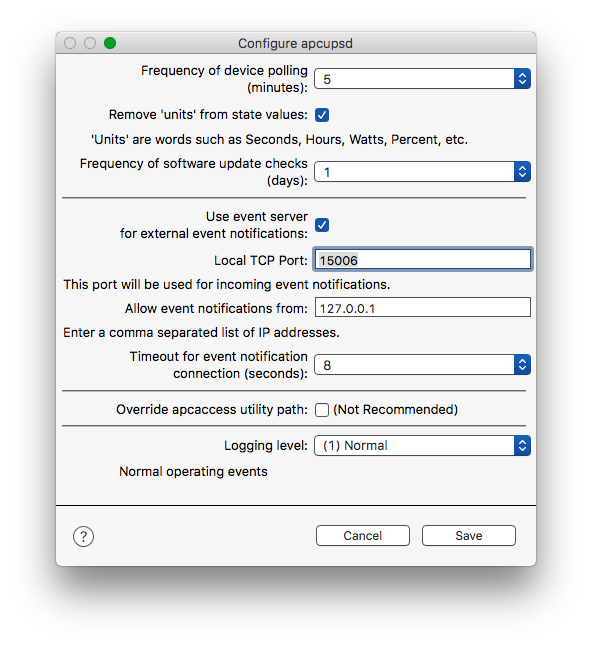

# acpupsd Plugin

> Because of the volatile nature of individual components within GitHub repositories such as this one, [__please only download actual releases__](../../releases). Any other downloads may result in an incomplete plugin, repeated errors in the Indigo log and/or incorrect behavior of the plugin.

> Note: This plugin **requires** the separate apcupsd software package (<http://www.apcupsd.org>) to be installed and running on whatever machine your APC UPS is connected to.

This is a software plugin for the [Indigo home automation software](http://www.indigodomo.com). The plugin allows access to the current state information for many models of [APC](http://www.apc.com) UPSes.

Unless otherwise noted, this plugin's releases should work with Indigo 5, 6 and 7. It is possible it might work in earlier versions of Indigo, but no testing has been done on them.

## Plugin Configuration

After you install the plugin you will need to configure it. In the __Configure apcupsd__ dialog, set the frequency at which the Indigo devices should be updated, a connection timeout, and a debugging level.

Once configured, the plugin will allow you to create an Indigo device for each apcupsd instance (IP Address & Port) you have.

## Device Configuration

When creating an apcupsd plugin device, you need to:

* Provide an IP Address. If you have the apcupsd software package running on the same machine as your Indigo server, select the default **local host**. Otherwise select **Will Specify** and enter the remote IP Address in the textfield that appears.
* Enter the port number. The default of 3551 should be correct for most installations.
* Select the UPS Report Fields you wish to use for states in this device. The default set contains the fields that are most likely to be of interest. Buttons are available to:
  - Select all states (fields)
  - Deselect all states (fields)
  - Reset default states list (i.e. Reset)
* Specify the state (field) to be displayed for this device in Indigo's Devices window State column
* Click Save

## Event Notifications

This release contains a built-in IP server to receive event notifications from the local apcupsd process, and instances of apcupsd running on remote systems. This feature is in addition to the Event Notification feature available in release 0.3.3, but is designed to ultimately replace that implementation.

To enable the new event server click the __Use IP Socket for events?__ checkbox in the __Configure apcupsd__ dialog. Then enter the local IP port to listen on and a comma separated list of IP addresses from which incoming connections can be accepted. If you are running apcupsd on the local host, be sure to include 127.0.0.1. The screenshot in the [Plugin Configuration](#plugin-configuration) section shows this.

To send events to the event server, you need to edit the event handlers in __/etc/apcupsd__. The following handlers (filenames __must__ match these names) are supported:

* commfailure
* commok
* doreboot
* doshutdown
* emergency
* endselftest
* failing
* loadlimit
* mainsback
* offbattery
* onbattery
* powerout
* remotedown
* runlimit
* startselftest
* timeout

Add the following text to each handler file you wish to have send events to the Indigo apcupsd plugin:

    #!/bin/sh
    
    EVENT=`basename $0`
    UPS=12345678
    
    /bin/echo -n "${UPS}:${EVENT}" |/usr/bin/nc -w1 127.0.0.1 15006 &

Make sure you enter the Indigo device ID for your UPS device as the value of the UPS variable in the script.

If you are comfortable with the command line interface of your Mac, you may wish to delete all but one of the handler files and then create them all again but as hard links to the one file you saved. In that way, you only need to edit one file to change all of the handlers.

## Troubleshooting and Discussions

Please use the [apcupsd plugin discussion forum](http://www.perceptiveautomation.com/userforum/viewtopic.php?f=22&t=10707) to post any issues, questions, ideas, etc.

## License

This project is licensed using [Unlicense](http://unlicense.org/).

## Plugin ID

Here is the plugin ID in case you need to programmatically restart the plugin:

**Plugin ID**: com.martys.apcupsd

