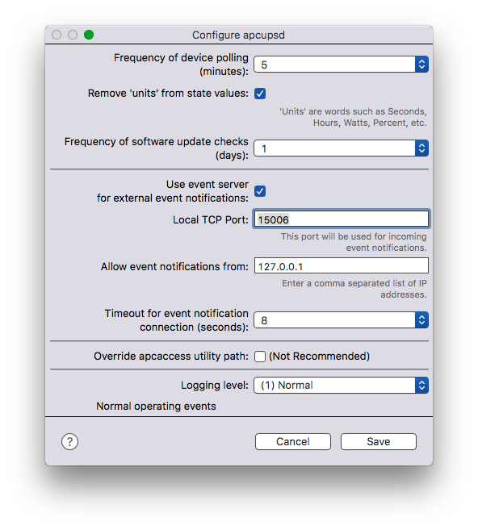

Table of Contents
=================

  * [Table of Contents](#table-of-contents)
  * [APCUPSD Plugin](#apcupsd-plugin)
    * [Upgrading from Plugin Versions Below 0\.5\.0](#upgrading-from-plugin-versions-below-050)
    * [Plugin Configuration](#plugin-configuration)
    * [Device Configuration](#device-configuration)
    * [Triggers](#triggers)
    * [Menu Items](#menu-items)
    * [Event Notifications](#event-notifications)
    * [Installing and Using the Plugin on Indigo 5](#installing-and-using-the-plugin-on-indigo-5)
    * [Troubleshooting and Discussions](#troubleshooting-and-discussions)
    * [Indigo Plugin ID](#indigo-plugin-id)
    * [License](#license)

Created by [gh-md-toc](https://github.com/ekalinin/github-markdown-toc.go)

# APCUPSD Plugin

This is a software plugin for the [Indigo Home Automation Server](http://www.indigodomo.com). The plugin allows access to the current state information for many models of [APC](http://www.apc.com) UPSes that can be physically attached to a computer via USB or a special networking cable.

> Because of the volatile nature of individual components within GitHub repositories such as this one, [__please only download actual releases__](../../releases). Any other downloads may result in an incomplete plugin, repeated errors in the Indigo log and/or incorrect behavior of the plugin.

> Note: This plugin **requires** a separate apcupsd software package (<http://www.apcupsd.org>) to be installed and running on whatever computer your APC UPS is physically connected to (not limited to Macs). While this separate package offers lots of configuration options, its default installation usually results in a perfectly usable setup for this plugin.

Unless otherwise noted, this plugin's releases should work without modifications with Indigo 6 and higher. With Indigo 5, minor steps after the plugin has been installed must be performed first—[see below](#installing-and-using-the-plugin-on-indigo-5). It is possible the plugin might work in earlier versions of Indigo but no testing has been done on them.

## Upgrading from Plugin Versions Below 0.5.0

If you are running a previous version of the plugin lower than 0.5.0 you will need to take some extra steps to migrate to the newer version. This should be a one-time activity, although future versions may have their own set of migration steps.

1. Run the Indigo client on the Indigo server system.
1. Select the __Plugins &mdash;> apcupsd &mdash;> Disable__ menu option to disable the older plugin.
1. Stop the Indigo Server, and any Indigo clients.
1. [Download the updated plugin](../../releases).
1. In the __Finder__:
  * Select the __Go &mdash;> Go to Folder...__ menu option and enter the following path:

            /Library/Application Support/Perceptive Automation/Indigo 7/Plugins (Disabled)
    (change Indigo 7 to Indigo 6 or Indigo 5 as appropriate to match your version of Indigo)
  * Drag the apcupsd.indigoPlugin from that folder to your Desktop.
  * Return back to the folder you downloaded the new version of the plugin.
  * If the new plugin download didn't automatically expand, double-click on the newly downloaded __.zip__ file (__apcupsd.indigoPlugin.zip__).
  * Double-click on __apcupsd.indigoPlugin__.
1. Follow the Indigo prompts for installing and enabling the plugin.
1. That should enable the plugin but if not, select the __Plugins &mdash;> apcupsd &mdash;> Enable__ menu option.
1. Setup the overall plugin settings (see [Plugin Configuration](#plugin-configuration) below).
1. Click the __Save__ button.
1. Reconnect existing Indigo apcupsd UPS devices to the new plugin. For each such device in the Indigo client DEVICES listing:
  * Double-click the matching device name.
  * The __Type:__ (or __Plugin:__ in Indigo 5) selector should be empty. Choose __apcupsd__ from the popup list.
  * Set the __Model:__ as __apcupsd UPS__.
  * Click the __Edit Device Settings...__ button.
  * Optional: click the __Query UPS for states__ button to match up the monitored states to the UPS.
  * Review the enabled state names.
  * Even if you didn't change anything, click Save on the __Configure apcupsd UPS__ dialog.
  * In Indigo 5, click OK on the __Edit Device__ dialog.

This should refresh your Indigo apcupsd UPS device states, while retaining associated triggers, state condition tests, etc. Should these steps not work you will need to delete the apcupsd UPS device(s) and recreate them.

## Plugin Configuration

After you install the plugin you will need to configure it. These settings apply to all UPS devices monitored by this plugin. You may need to scroll the dialog's contents to see all the settings. In the __Configure apcupsd__ dialog (__Plugins &mdash;> apcupsd &mdash;> Configure...__ menu option) you:

* Set the frequency at which the devices should be queried and their state values updated. The default is every 5 minutes.
* Decide if you want reported "units" (Minutes, Hours, Percent, etc.) to be removed from the device's state values. The default is "checked" (this makes it easier for device state comparisons).
* Set the frequency for plugin software update checking. The default is every day.
* See the [Event Notifications](#event-notifications) section below for setting the __Use event server for external event notifications__ checkbox. The default is "unchecked."
* Decide if you need to override the location of the __apcaccess__ utility in the separate apcupsd package. The default is "unchecked". This is an advanced feature and should remain "unchecked" unless the plugin cannot locate this utility.
* Set a logging level. The default is level 1.
* Click __Save__.

All items on the __Configure apcupsd__ dialog include tooltips—just hover over an item of interest for a quick reminder of its purpose.

Once configured, the plugin will allow you to create an Indigo device for each apcupsd instance (IP address and port) you have for your attached UPSes.

## Device Configuration

When creating an APCUPSD plugin device, you:

* Provide a name for your device. If you are planning on using the event notification server feature of the plugin your device name needs to be no longer than 128 characters.
* For Indigo 6 and higher: set the __Type:__ selector to be __apcupsd__ from the popup list.
* For Indigo 5: set the __Type:__ selector to be __Plugin__ and set the __Plugin:__ to be __apcupsd__ from the popup list.
* Set the __Model:__ to be __apcupsd UPS__ from the popup list.

On the resulting __Configure apcupsd UPS__ dialog (you may need to scroll to see all the settings):

* Provide an IP address. If you have the apcupsd software package running on the same machine as your Indigo server, select the default **local host**. Otherwise select **Will Specify** and enter the remote IP address in the textfield that appears.
* Enter the port number. The default of 3551 should be correct for most installations. The port number is established by the external apcupsd package installation.
* Select the UPS report fields you wish to use for states in this device. The default set contains the fields that are likely to be of interest. Buttons are available to:
  - __Query UPS for states__ (clears state checkboxes this UPS does not support, and sets those that it does)
  - __Select all states__ (fields)
  - __Deselect all states__ (fields)
  - __Reset default states__ from a built-in list in the plugin
* Specify the state (field) to be displayed for this device in the Indigo client's DEVICES listing State column. The default is __status__.
* Click __Save__.

All items on the __Configure apcupsd UPS__ dialog include tooltips—just hover over an item of interest for a quick reminder of its purpose.

## Triggers

If you have setup one or more of the __/etc/apcupsd/__*filename* handler files (see [Event Notifications](#event-notifications), you can create Indigo triggers for the matching event(s) to allow near-realtime reaction to status changes in the UPS.

Even without Event Notifications, you can create triggers based upon device state value changes. These state changes are only updated as frequently as you have configured the plugin to poll the UPS devices so there may be some delay in the trigger event being activated by Indigo. For example, if you have a trigger set to watch for changes to a UPS device's TIMELEFT value and your polling frequency is every 5 minutes, the trigger can still test for values but should take note that if TIMELEFT is less than 5 (minutes) that another trigger may not occur before the UPS has shutdown. Testing against a value of less than 10 should still give the trigger a chance to take appropriate actions.

## Menu Items

A set of commands are available in the __Plugins &mdash;> apcupsd__ menu that can be used for specific on-demand features.

* Check for Updates — force the plugin to check for a software update
* Log full report on all UPSs — places a report into the Indigo log showing the status information for each enabled UPS device
* Refresh All UPSs — force each enabled UPS device to update its Indigo state values
* Look for old devices — identify any Indigo UPS devices that aren't migrated from the pre-0.5.0 version of the plugin

## Event Notifications

The separate apcupsd package provides a mechanism to perform site-specific steps when certain events are detected on a monitored UPS. One such step can be to send a notification to the Indigo server. This plugin contains an event notification server to receive those event notifications from the local apcupsd process, via its __/etc/apcupsd/apccontrol__ shell script, and from instances of apcupsd running on remote systems via the same mechanism. This event server is __not__ required to be used *unless* you plan to have the Indigo server react to UPS changes via triggers.

To enable the event server in the __Plugins &mdash;> apcupsd &mdash;> Configure...__ dialog:

* Click the __Use event server for external event notifications__ checkbox.
* Enter the local TCP port to listen on. This must be an unused port on the Indigo Server—15006 is used as an example.
* Enter a comma separated list of IP addresses from which incoming event connections can be accepted. If you are running the external apcupsd package on the Indigo server, be sure to include 127.0.0.1.

The screenshot in the [Plugin Configuration](#plugin-configuration) section shows this feature enabled.

To send these external events to the plugin's event server, you need to edit the desired event handler files in __/etc/apcupsd/__*filename*. The following handlers (*filename* __must__ match these names) are supported (create them if they do not exist and you want to receive that event in Indigo):

* annoyme
* battattach
* battdetach
* changeme
* commfailure
* commok
* doreboot
* doshutdown
* emergency
* endselftest
* failing
* killpower
* loadlimit
* mainsback
* offbattery
* onbattery
* powerout
* readApcupsd (not used by apcupsd/apccontrol, but can be used as a test event script)
* remotedown
* runlimit
* startselftest
* timeout

Add the following text to each handler file you wish to have send events to the Indigo APCUPSD plugin:

    #!/bin/sh
    
    source /etc/apcupsd/tell_indigo $(basename $0) "$1"

Open a Terminal (__/Applications/Utilities/Terminal__) window and issue this command (please Copy from this document and Paste the entire line into the Terminal window):

    sudo cp -p "/Library/Application Support/Perceptive Automation/Indigo 7/Plugins"/apcupsd.indigoPlugin/Contents/Resources/tell_indigo /etc/apcupsd/
(change Indigo 7 to Indigo 6 or Indigo 5 as appropriate to match your version of Indigo)

Review and edit __/etc/apcupsd/tell_indigo__ as needed to set the proper __INDIGO_SERVER__ and __INDIGO_PORT__ values. Note that if your Indigo device name contains a colon (:) or unicode characters then the __/etc/apcupsd/tell_indigo__ script must use the matching numeric device ID. That can be accomplished within the example _case_ statement in the script.

If you are comfortable with the command line interface of your Mac, you may wish to delete all but one of the handler files and then create them all again but as symlinks (*not* Finder aliases) to the one file you saved. In that way, you only need to edit one file to change all of the handlers.

## Installing and Using the Plugin on Indigo 5

Because Indigo 5 uses an older version of Python for its plugin execution, some minor code changes must be made to the plugin distribution to work with that older version of Python. __These changes must be made any time the plugin is updated on your Indigo 5 system.__ Without making these code changes the plugin __will not__ function properly and will log errors to the Indigo log on an on-going basis.

1. Run the Indigo client on the Indigo server system.
1. Select the __Plugins &mdash;> apcupsd &mdash;> Disable__ menu option.
1. Open a Terminal (__/Applications/Utilities/Terminal__) window and issue this command (please Copy from this document and Paste the entire line into the Terminal window):

        /Library/Application\ Support/Perceptive\ Automation/Indigo\ 5/Plugins\ \(Disabled\)/apcupsd.indigoPlugin/Contents/Resources/use_on_Indigo5
    If you get a "No such file or directory" error and no "Starting" message, you do not have the plugin disabled.
1. Select the __Plugins &mdash;> apcupsd &mdash;> Enable__ menu option.
1. Proceed with setting up the [Plugin Configuration](#plugin-configuration) and the [Device Configuration](#device-configuration) for your UPSes.

## Troubleshooting and Discussions

Please use the [APCUPSD Plugin discussion forum thread](http://www.perceptiveautomation.com/userforum/viewtopic.php?f=22&t=10707) to post any issues, questions, ideas, etc.

## Indigo Plugin ID

Here is the plugin ID in case you need to programmatically restart the plugin:

		com.martys.apcupsd

If you find that you do need to restart the plugin in this way, perhaps there is something that can be done in the code to lessen that need. Please bring it up in the forum.

## License

This project is licensed using [Unlicense](http://unlicense.org/). All mentioned software other than the plugin itself may be covered by different licenses.
